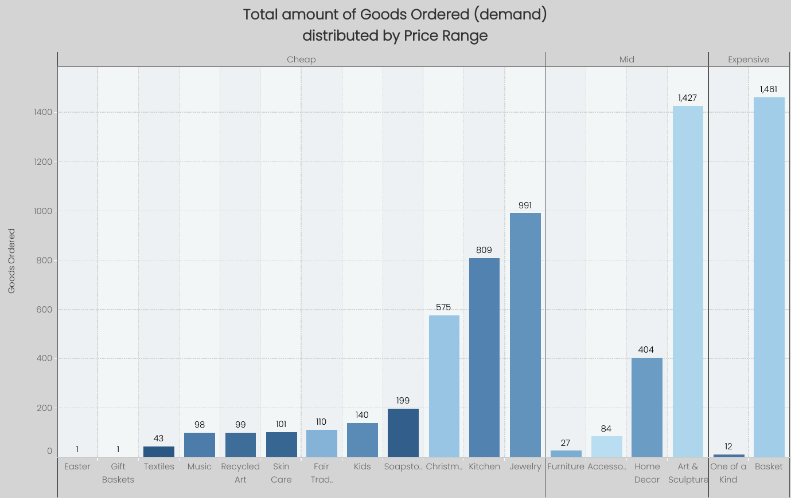

# Retail Business Analysis
## Short overview of the project
This dashboard will be devide into 2 main parts, where I will showcase the business' products and sales KPI analysis respectively, based on the collected data of a real small retail online business. You can find the [original datasets](uploaded/orig.datasets), as well as [SQL queries](uploaded/sql.queries) and [tables](uploaded/finalised.tables) used for the final reporting, by clicking on the text.

<b>*Please note</b> that the sales and products tables do not relate. The data is very limited, so I tried my best to extract the most valuable insights.

## Products' KPI
<i>Note: All the charts are ranged from Jan 2017 to Dec 2019. The terms “cheap” and “expensive” are used interchangeably with “budget” and “premium,” respectively.</i>

### Overall Performance

The following chart shows us how the company's Net Sales are related to the Demand, giving us a perspective on what product types perform better than the others. The demand is calculated by sold goods and not total orders!, where if the quantity is bigger than the average across all product types, it's given to be "High", where if it's lower and also smaller than 100 - "Low", everything else falls in-between - "Average". 

From this graph, you can clearly see that "Gift Basket" and "Easter" are the weakest in performance, both by demand and total profits.

You could also notice that the top 3 performers in the low demand category have bigger net sales than some products from the average one. This is a good sign, indicating the presence of bulk buyers and their solvency.

And yet, the top performers across all products are those with the highest demand, placing low- and average-demand sectors on the same level by comparison.

### Customers' Solvency

The image below ilustrates the relationship between the total amount of Goods Ordered and Price Ranges.
Range of the product is calculated by its average, and according to the quartiles method.

Once again, we can see that “Easter” and “Gift Baskets” are the weakest performers, with all their net sales coming from just a single order. On the other hand, the most in-demand products fall within the mid and high price ranges—though this applies only to one or two standout types. Other products in these ranges fail to compete even with those in the cheap category.

When grouped by price range, the budget segment leads with 3,167 units sold, followed by the mid range with 1,942, and the premium range with 1,473. While budget products dominate in volume, this does not mutually exclude the customers’ willingness to purchase higher-priced items when they find them worthwhile.

### Conclusion

Net sales are directly driven by the total number of goods ordered, with orders concentrated in the budget price range, which remains the most popular segment.

Notwithstanding, "Basket", "Art & Sculpture" and "Jewerly" continue to lead in sales, representing the main customer interest and a primary source of profit for the business; making these categories — particularly the first two — a focus for promotion and marketing could be highly beneficial, since they are already in high demand and fall within the most profitable price ranges. This alone forms a solid base for growth.

## Sales Performance

